# Guía de Configuración de Entornos de Desarrollo

> 📋 **Guía Técnica**: Esta documentación establece los procedimientos para configurar un entorno de desarrollo en C# y otros lenguajes. Incluye las configuraciones necesarias para mantener consistencia en el desarrollo de software.

> **Nota importante**: Este documento se enfoca en aspectos técnicos y procedimientos. Para análisis comparativos, reflexiones personales y conclusiones, utiliza el archivo `CONCLUSIONES_EVALUACION.md`.

**Autores**: [Felipe] y [Alejandro]
**Fecha V0**: [Fecha de entrega inicial]
**Fecha V1**: [08/11/2025]

---

## Visual Studio Code - Entorno Principal

### Instalación y Verificación

**Método de instalación:** [Especifica el método recomendado]

> **💡 Sobre las imágenes**: Incluye capturas de pantalla para mostrar los diferentes pasos o resultados. Ejemplo: `

**Proceso de instalación:**
- **Descarga:** [Me dirigo al sitio oficial de vsc y hago click en descargar, me lleva a este link https://code.visualstudio.com/Download  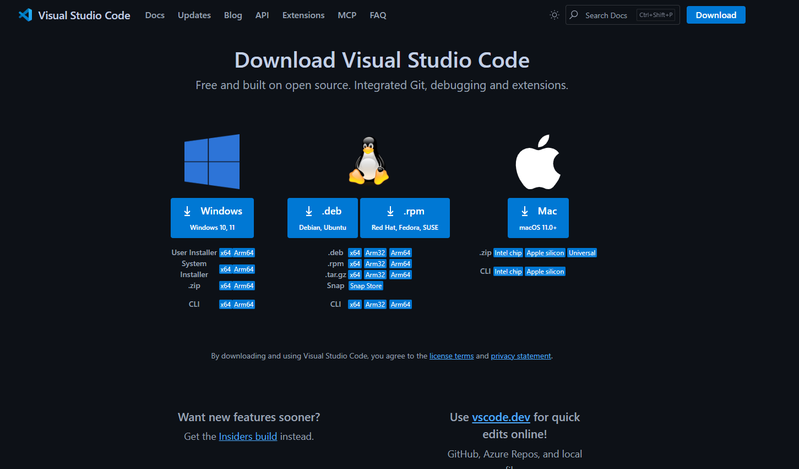 nos da a escojer el sistema operativo, da para escojer entre windows, linux, o MacOS, yo me baje el de windows ]
- **Opciones del instalador:** [al ejecutar el instalador nos pide que aceptemos un acuerdo lo aceptamos y luego nos pide que establezcamos un path o un acceso directo, finalmente le damos a instalar]
- **Verificación:** [abrimos vsc ya sea con el acceso directo o buscandolo en la lupa  si nos abre es que todo estra correcto, sino puede que haya algun archivo corrupto y haya que reinstalarlo]

*Es posible documentar múltiples métodos.*

### Uso Básico de VS Code

**Navegación y funcionalidades básicas:**
- Navegación por la interfaz: en la barra lateral tenemos iconos para buscar o acceder a las extensiones. tambien está el area del editor.
- Edición de código: aqui podemos abrir un archivo para modificar su codigo.
- Uso de la paleta de comandos: si pulsamos Ctrl+Shift+p podemos abrir la paleta y ahi ejecutar los comandos.
- Gestión de archivos y carpetas: arriba a la izquierda hay una sección llamada "File" en la que nos aparecen diferentes opciones como abrir una carpeta o archivo o crear uno nuevo. 

### Personalización del Entorno

**Configuraciones aplicadas:** [Describir las personalizaciones que se realizaron]

*Ejemplos de configuraciones útiles (elegir las que se consideren relevantes):*

**Temas e iconos:**
Cambie el tema de vsc metiendome en Archivos, Preferencias, y luego temas

Despues instale mas iconos con la extension file icons
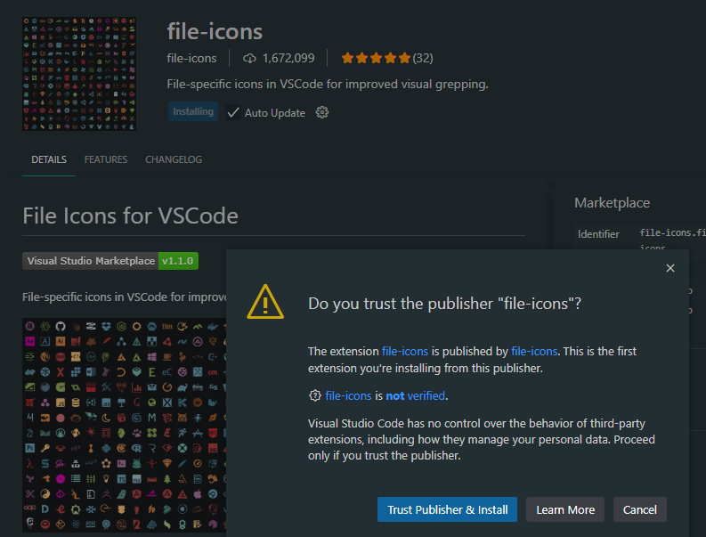
**Configuración de fuentes:**
Cambie el tamaño de la fuente a 15 y la cambie por comic sans metiendome a Archivo, Preferencias, Ajustes y buscando "Fuentes"
![fuentes en ajustes]
aqui se puede ver todos los cambios aplicados a la vez
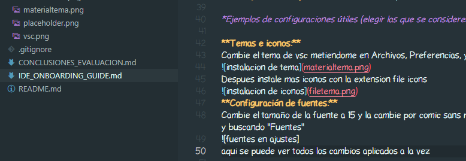
**Atajos de teclado útiles:**
Ejemplos:
- Ctrl+/ para comentar/descomentar
- Ctrl+Shift+P para paleta de comandos
- Ctrl+` para terminal integrada
- Alt+↑/↓ para mover líneas

**Configuración del editor:**
Ejemplos:
- Formateo automático al guardar
- Detección automática de indentación
- Word wrap para líneas largas

**Terminal integrada:**
Ejemplos:
- PowerShell como terminal predeterminado
- Configuración de perfil personalizado

> **Personaliza según tus necesidades**: Estas son sugerencias basadas en prácticas comunes. Experimenta y documenta las configuraciones que encuentres más útiles para tu flujo de trabajo.> 💼 **Manual de Incorporación**: Esta guía establece los estándares del equipo para configurar entornos de desarrollo en C#. Cualquier nuevo desarrollador debe poder seguir estas instrucciones para configurar su entorno de trabajo de manera consistente con el resto del equipo.

### SDK .NET

**Proceso de instalación:**
1. **Descarga e instalación:** [Entro al sitio de SDK microsoft https://dotnet.microsoft.com/es-es/download/visual-studio-sdks y descargo la version .NET 10.0 x64 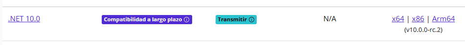despues de descargarlo ejecutamos el instalador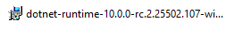y le damos al boton de instalar 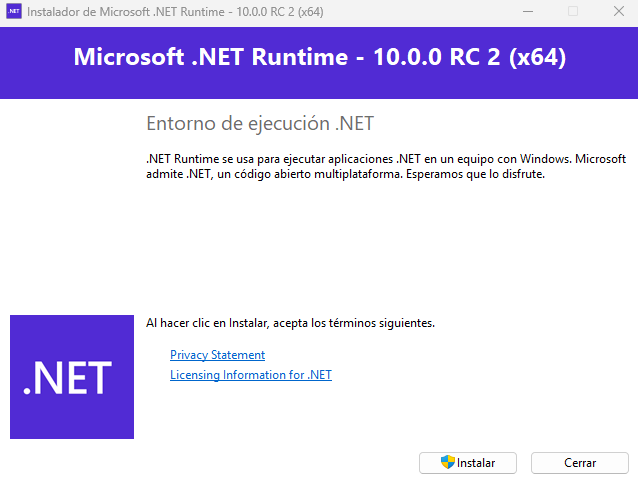]
2. **Verificación:** [para comprobar que todo esta bien nos metemos al cmd de windows y ponemos dotnet --info, si nos sale la version y mas datos de la siguiente manera: 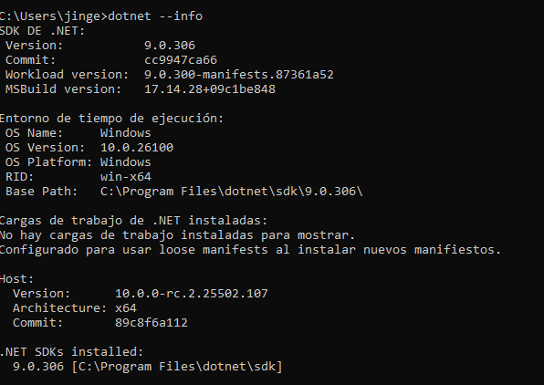]

### Configuración para C#

**Extensiones esenciales:**
- **Soporte oficial para C#**: Extensión que proporciona IntelliSense, debugging y compilación


**Configuraciones específicas para C#:** 
[Describir las configuraciones que se aplicaron, como formateo automático, intellisense, o configuraciones del compilador]
[descarge las dos extensiones oficiales de c# de microsoft 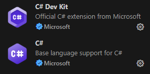 despues active la casilla de formateo automatico en Archivo, Preferencias, Ajustes, 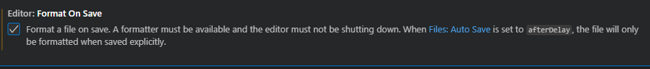]
**Debugging básico:**
- Configuración de puntos de interrupción (breakpoints)
- Ejecutar y depurar
- Inspección de variables

> **Enfoque práctico**: [coloco un punto de breakpoint haciendo click en la izquierda de la linea que quiero detener la ejecucion, luego selecciono iniciar depuracion para ejecutar el programa en modo debug cuando la ejecucion se detiene en el breakpoint puedo inspeccionar las variables pasando el raton sobre ellas uso los controles de depuracion para analizar el codigo y detectar errores, luego cambio el codigo para que no falle viendo lo que a fallado]

### Flujo de Trabajo con C#

**Creación de proyectos:**
[usamos el "comando dotnet new console -o prueba" console indica que el proyecto sera una aplicacion de consola -o es el nombre de la carpeta donde se guarda el proyecto program.cs contiene el punto de entrada del programa .csproj define el tipo de proyecto, la version de .NET dependencias y configuraciones del compilador]

**Estructura de proyecto:**
```csharp
using System;

class Program
{
    static void Main()
    {
        Console.WriteLine("hola buenas tardes");
    }
}
el programa imprime un mensaje en la pantalla para ver que la compilacion y ejecucion funcionan.
```

**Compilación y ejecución:**
[hice el proceso de compilacion y ejecucion en la terminal con estos comandos "dotnet new console -o Prueba" "cd ProyectoEjemplo" y despues dotnet run]

**Debugging:**
[coloque un breakpoint en la linea del Console.WriteLine("hola buenas tardes); luego ejecute el programa con iniciar depuracion, cuando se paro verificó codigo y el valor de las variables (pero no habia variables en mi codigo)luego sigio la ejecucion para comprobar que se imprimiese bien el mensaje]
---

## Visual Studio - IDE Alternativo

### Instalación 

**Proceso de instalación:**
- **Descarga:** [entro a https://visualstudio.microsoft.com/es/ y le doy al boton de descargar 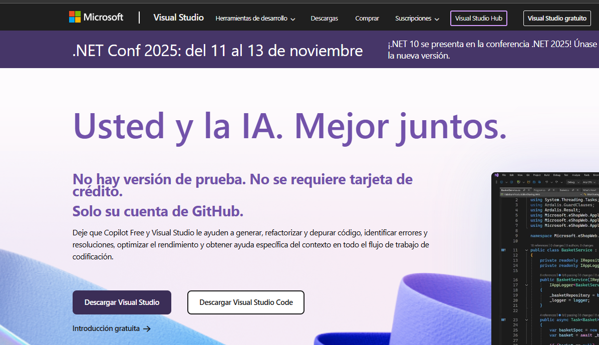despues ejecuto el instalador]
- **Componentes necesarios:** [selecciono la carga de trabajo para desarrollo de escritorio de dotnet 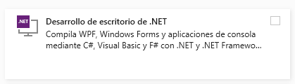]
- **Verificación:** [abre visual studio y luego en la pantalla principal selecciona "crear un proyecto" 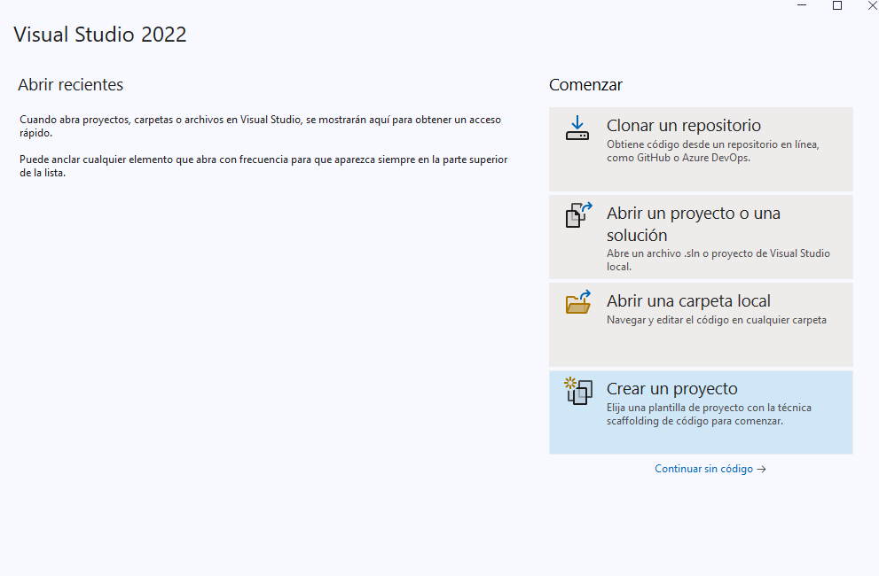 aplicacion de consola net core de la lista disponible asigna un nombre y una carpeta de destino para guardar el proyecto y por ultimo haz clic en crear proyecto para comenzar]

### Desarrollo con C#

**Creación de proyecto:**
[abre visual studio y crea un nuevo proyecto de consola net pon nombre y ubicacion pulsa f5 para ejecutar y usa solution explorer para ver archivos y depurar con puntos de interrupcion]

**Flujo de trabajo básico:**
- Compilación y ejecución
- Uso de Solution Explorer
- Debugging básico

---

## Configuración de Lenguaje Adicional

**Lenguaje seleccionado:** [Python] - **Justificación:** [Escoji este lenguaje porque ya lo instale anteriormente en otra practica y lo recuerdo mas simple que java]

### Instalación del Entorno
[me meto al sitio de python https://www.python.org/ y hago click en descargar la ultima version 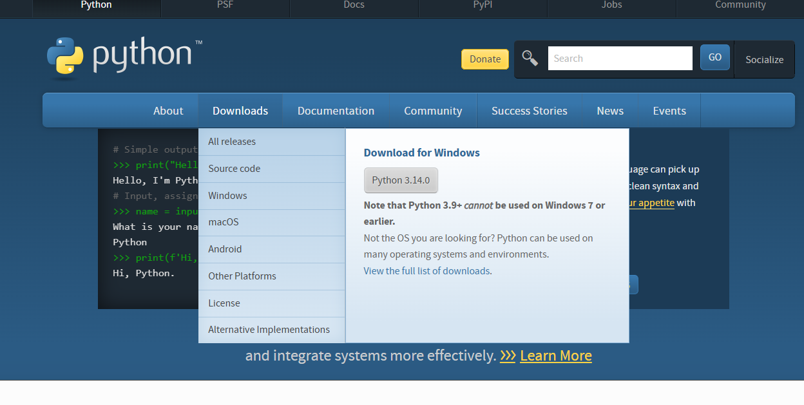]
**Runtime/SDK:**
- **Descarga e instalación:** [una vez descargado ejecuta el instalador marca la casilla add python to path y luego haz clic en install now espera a que el proceso termine y cierra el instalador]
- **Verificación:** [abre la terminal o el simbolo del sistema y escribe python --version o python3 --version si muestra un numero de version significa que python se instalo correctamente]

### Configuración en VS Code

**Extensiones por lenguaje:**

*Para Java:*
- **Paquete completo de Java**: Incluye compilación, debugging y gestión de proyectos

*Para Python:*
- **Soporte oficial de Python**: 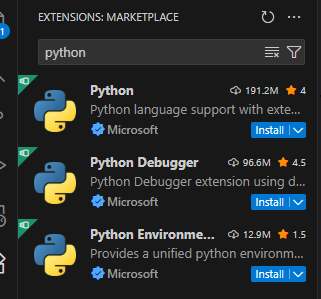

*Para otros lenguajes:*
- Busca la extensión oficial del lenguaje que proporcione soporte completo

**Configuraciones específicas aplicadas:**
[se dejaron los ajustes de fabrica]

### Proyecto de Ejemplo

**Código desarrollado:**
```[python]
from datetime import datetime

nombre = input("mete tu nombre: ")
edad = int(input("mete tu edad: "))

anio_actual = datetime.now().year
anio_cien = anio_actual + (100 - edad)

print(f"{nombre}, cumpliras 100 años en el año {anio_cien}")

# este programa te pide nombre y edad
# luego calcula en que año cumples 100 años
```

**Proceso de ejecución:**
[para ejecutar el codigo abro la terminal y navego hasta la carpeta donde guarde el archivo con extension .py y escribo python edad100.py y luego presiono enter y el programa se ejecuta]

---

## Configuraciones Recomendadas

**Configuraciones generales:**
[activar numeros de linea en el editor, habilitar guardado automatico, elegir un tema de color comodo y configurar fuente y tamaño legibles]

**Herramientas adicionales:**
[instalar extensiones de python o csharp para autocompletado y resalte de sintaxis, linters para revisar errores automaticamente, y herramientas de control de versiones como git o git gui]

**Solución de problemas comunes:**
[si hay errores de version de python, verificar que este agregado al path del sistema, usar pip para instalar dependencias faltantes; si visual studio no reconoce proyectos de .net, comprobar que la carga de trabajo de desarrollo de escritorio esta instalada]

**Recursos útiles:**
- Enlace [https://www.python.org/doc/)]: [sitio oficial para descargar python y consultar su documentacion]
- Documentación [(https://code.visualstudio.com/docs)]: [guias y tutoriales oficiales para aprender a usar visual studio]

---
